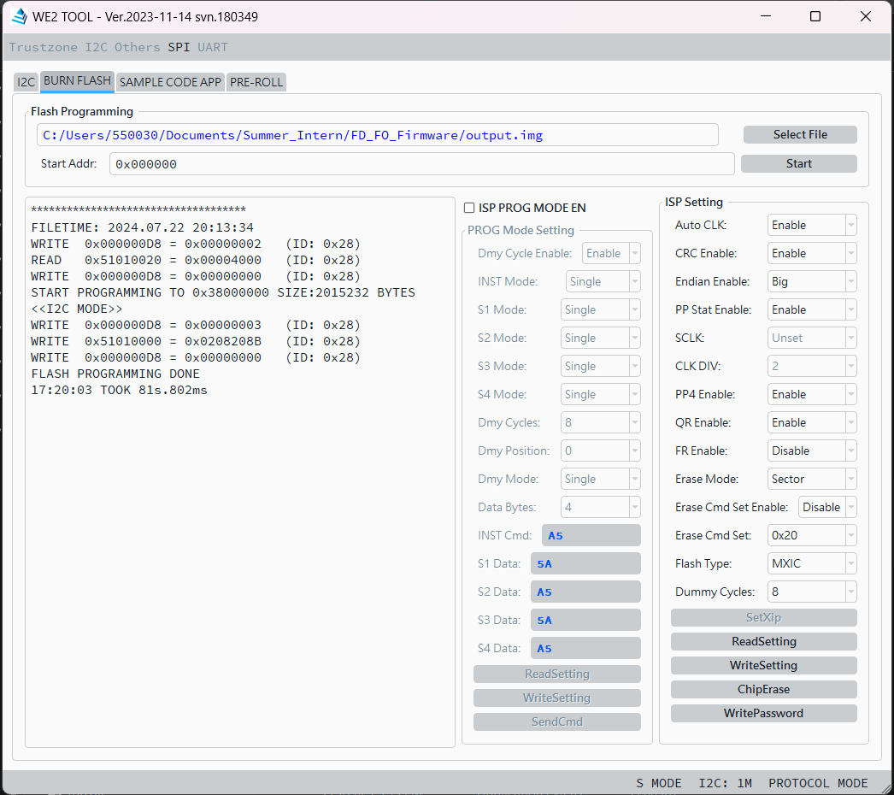
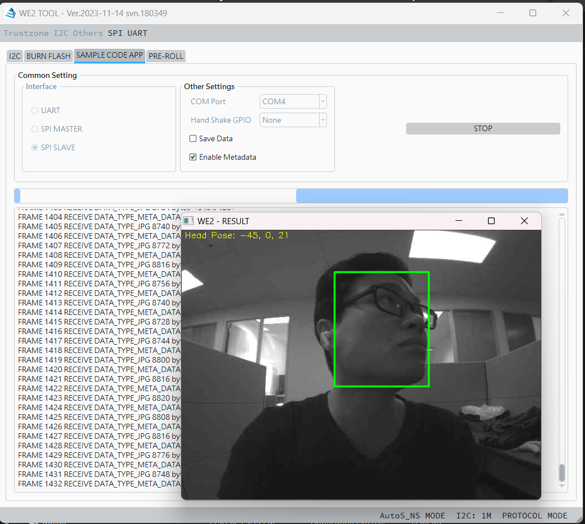
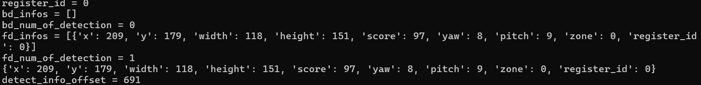

## Introduction

This repository containes the code for the ISM028 listener and the ISM028 slave with FT4222 library. The ISM028 listener listens to the metadata transfer event from the ISM028 slave and writes the metadata to a named pipe. The ISM028 slave reads the metadata from the named pipe and sends the metadata to the named pipe reader.

## Installation

Install miniconda / anaconda if you don't have one.

```bash
(base) $ conda env create -f environment.yml
```

## How to run
Run the listener for the metadata transfer event by named pipe:
```bash
(base) $ conda activate listener
(listener) $ python named_pipe_writer_ism028.py
```

You can read the metadata from the named pipe by running the following command:
```bash
(listener) $ python named_pipe_reader.py
```

Or just use any language you like to read the named pipe. 








If you just want to start the ISM028 as a slave, you can run the following command:
```bash
(listener) $ python start_ism028.py
```

This is useful for the use case of keyword spotting:
```bash
(listener) $ python start_ism028.py

# in an another shell
(listener) $ python kws_listener.py
```

If you want to run it with a GUI interface to have a look at, run
```bash
(lilstener) $ python app_spis_tool_ism028_demo.py
```